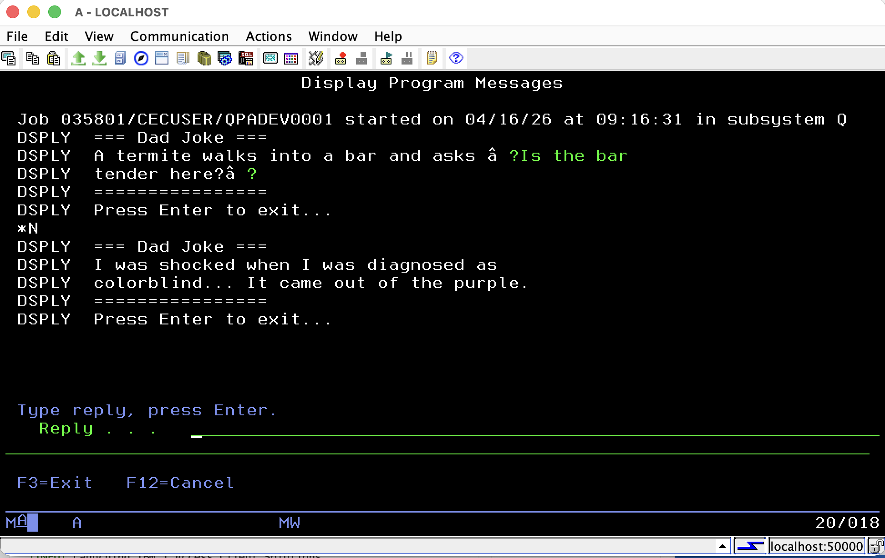

# Dad Joke RPG Program

IBM i RPG program that fetches random dad jokes from [icanhazdadjoke.com](https://icanhazdadjoke.com/) and displays them via DSPLY.

**Generated from**: [`spec/DADJOKE-SIMPLE-SPEC.md`](spec/DADJOKE-SIMPLE-SPEC.md)

## Components

- **RPG Program**: [`QRPGLESRC/DADJOKE.PGM.RPGLE`](QRPGLESRC/DADJOKE.PGM.RPGLE) - Fetches jokes via HTTPAPI
- **Compile Script**: [`scripts/compile-dadjoke.sh`](scripts/compile-dadjoke.sh) - Builds on remote IBM i
- **Run Script**: [`scripts/run-dadjoke.sh`](scripts/run-dadjoke.sh) - Executes and displays output

## Requirements

- IBM i system with LIBHTTP installed
- SSH access with key authentication
- HTTPAPI service program (LIBHTTP/HTTPAPIR4)